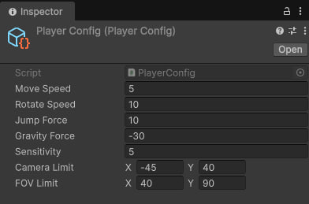

# Проект "CharacterController"  

  

  

## Описание проекта
Реализован физический контроллер персонажа с собственной системой гравитации. Параметры управления настраиваются в реальном времени через специальный конфигурационный файл игрока.  

## Ключевые особенности и архитектура

### Расширяемость
Система спроектирована с высокой степенью гибкости и расширяемости. Параметры контроллера настраиваются в конфигурации.  

  

